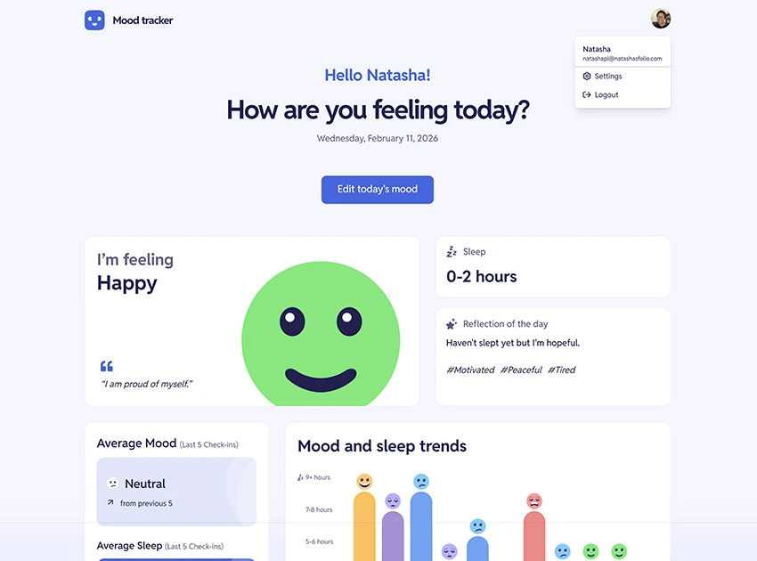

# Frontend Mentor - Mood tracking app solution

This is a solution to the [Mood tracking app challenge on Frontend Mentor](https://www.frontendmentor.io/challenges/mood-tracking-app-E2XeKhDF0B). Frontend Mentor challenges help you improve your coding skills by building realistic projects.

## Table of contents

- [Overview](#overview)
  - [The challenge](#the-challenge)
  - [Screenshot](#screenshot)
  - [Links](#links)
- [My process](#my-process)
  - [Built with](#built-with)
  - [Key Features](#key-features)
  - [What I learned](#what-i-learned)
- [Author](#author)

## Overview

### The challenge

Users should be able to:

- Log their mood, feelings, reflections, and sleep each day
- See today's mood, feelings, reflection, and sleep, once logged
- See a relevant mood quote based on today's mood (found in the `data.json` file)
- See a graph showing the most recent eleven records to identify mood and sleep trends
- Interact with each bar on the mood and sleep trends chart to see all information about that day
- See their average mood and sleep from the past five check-ins and see how they compare with the previous five
- Update their name or avatar through settings
- View the optimal layout for the interface depending on their device's screen size
- See hover and focus states for all interactive elements on the page
- **Bonus**: Save details to a database (build the project as a full-stack app) ✅
- **Bonus**: Create an account and log in (add user authentication to the full-stack app) ✅
- **Bonus**: Integrate with a third-party image-hosting service for the avatar upload ✅

### Screenshot



### Links

- Solution URL: [https://github.com/natashapl/mood-tracking-app](https://github.com/natashapl/mood-tracking-app)
- Live Site URL: [https://moodtracker.natashasworld.com](https://moodtracker.natashasworld.com)

## My process

### Built with

- **Frontend:**
  - React 19 with TypeScript
  - Vite (for fast development and optimized builds)
  - Tailwind CSS (for utility-first styling)
  - Recharts (for interactive mood and sleep trends visualization)

- **Backend & Services:**
  - Supabase (PostgreSQL database, authentication, and storage)
  - Google OAuth 2.0 & GitHub OAuth (third-party authentication)
  - Supabase Storage (for avatar image hosting)
  - Google Workspace SMTP (custom email branding for auth emails)

- **Development Practices:**
  - Semantic HTML5 markup with ARIA labels for accessibility
  - Mobile-first responsive design
  - TypeScript for type safety
  - Component-based architecture
  - Custom React hooks for state management

### Key Features

**Authentication System:**
- Email/password authentication with email confirmation
- Google OAuth and GitHub OAuth integration for one-click sign-in
- Automatic profile creation with OAuth metadata (name and avatar)
- Custom email branding using Google Workspace SMTP (welcome@natashasworld.com)
- Protected routes and session management

**Mood Tracking:**
- Multi-step wizard for capturing daily mood, feelings, sleep, and reflections
- Dynamic mood quotes based on selected mood
- Edit capability for today's entry
- Local date handling to prevent timezone issues

**Data Visualization:**
- Interactive trends chart showing 11 most recent entries
- Mood and sleep data visualization with custom tooltips
- Click-through to view full entry details for any day
- Average calculations with comparison to previous period

**User Profile:**
- Settings modal for name and avatar updates
- Avatar upload with validation (2MB max, image files only)
- Supabase Storage integration for secure image hosting
- Automatic avatar sync from OAuth providers on sign-in

**Data Management:**
- Real-time data sync with Supabase
- Automatic deduplication (one entry per day)
- Error handling and loading states
- Development testing utilities for sample data generation

### What I learned

This project provided hands-on experience with several advanced full-stack concepts:

**OAuth Integration:**
Implementing multiple OAuth providers (Google and GitHub) required understanding the complete authentication flow, handling OAuth callbacks, and syncing user metadata (name and avatar) from each provider to the application profile. The challenge was managing existing users who later sign in with a different provider - detecting when to update their profile with OAuth data without overwriting user customizations, and handling Supabase's account linking when multiple providers share the same email.

```typescript
// Auto-sync OAuth avatar for existing profiles
if (user && (user.app_metadata.provider === 'google' || user.app_metadata.provider === 'github')) {
  const oauthAvatar = user.user_metadata.picture || user.user_metadata.avatar_url;
  if (!data.avatar_url && oauthAvatar) {
    await supabase
      .from('profiles')
      .update({
        avatar_url: oauthAvatar,
        updated_at: new Date().toISOString()
      })
      .eq('id', userId);
  }
}
```

**File Upload Security:**
Implementing proper file upload validation and using Supabase Storage's built-in security through Row Level Security (RLS) policies ensures users can only access their own uploaded avatars.

**Custom Email Configuration:**
Setting up SMTP relay with Google Workspace to send authentication emails from a custom domain (welcome@natashasworld.com) significantly improves the professional appearance and reduces the likelihood of emails being marked as spam.

**Accessibility:**
Adding semantic HTML landmarks (`<main>`) and proper autocomplete attributes improves both accessibility and user experience, making the app usable for screen readers and enabling browser autofill capabilities.

```html
<input autoComplete="email" />
<input autoComplete={isLogin ? "current-password" : "new-password"} />
```

**Date Management:**
Working with dates across timezones required creating utility functions to ensure mood entries are always associated with the correct local date, preventing entries from appearing on the wrong day due to UTC conversion.

## Author

- Website - [Natasha Pierre-Louis](https://www.natashasfolio.com/)
- Frontend Mentor - [@natashapl](https://www.frontendmentor.io/profile/natashapl)
- LinkedIn - [natashapl](https://www.linkedin.com/in/natashapl/)
